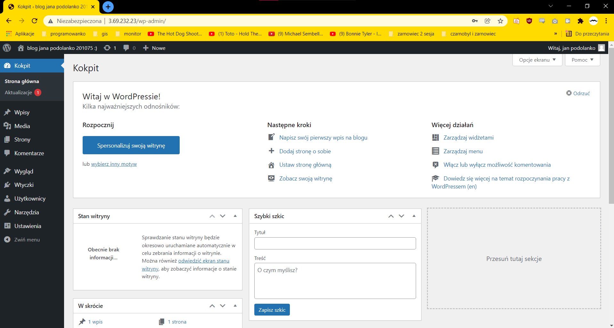

## Instalacja
1. Stworzenie dwóch instancji maszyn na AWS
2. Wejscie na serwer ssh 201075@sokrates.edu.jkan.pl
3. Umieszczenie tam plikow z repo
4. "eval \`ssh-agent\`" w terminalu
5. "ssh ec2-user@<ip_maszyny> -i id_student" dla obu adresow ip instancji
6. "ssh-add id_student"
7. "ansible-playbook -i hosts.ini setup_wp.yaml -e DB_PW='hasło'" wlaczenie samej aplikacji
8. Dalej konfiguracja wordpressa z kokpitu (widocznego na screenshocie)

